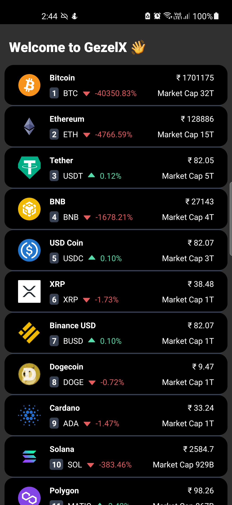

# GezelX

## Crytpo currency listing built with React Native

Displays a Paginated list of Crypto tokens with information such as rank, symbol, price percentage change, market cap, and current value.

<pre>
  
</pre>

**stack**

- tailwind names rn
- Moxbx.js
- CoinGecko API

**Enhancements**

- Show Price history chart

**Development**

- install react native cli from [here](https://reactnative.dev/docs/environment-setup)
- connect a physical device
- run `npx react-native run-android`
- in a new terminal run `npx react-native start`

You can now reload the app using `r` key
